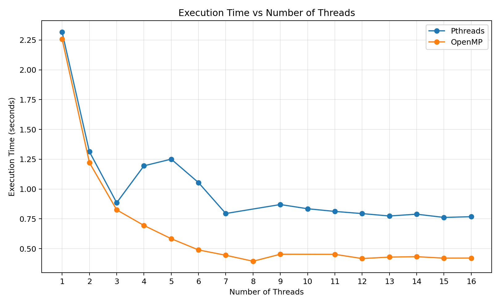
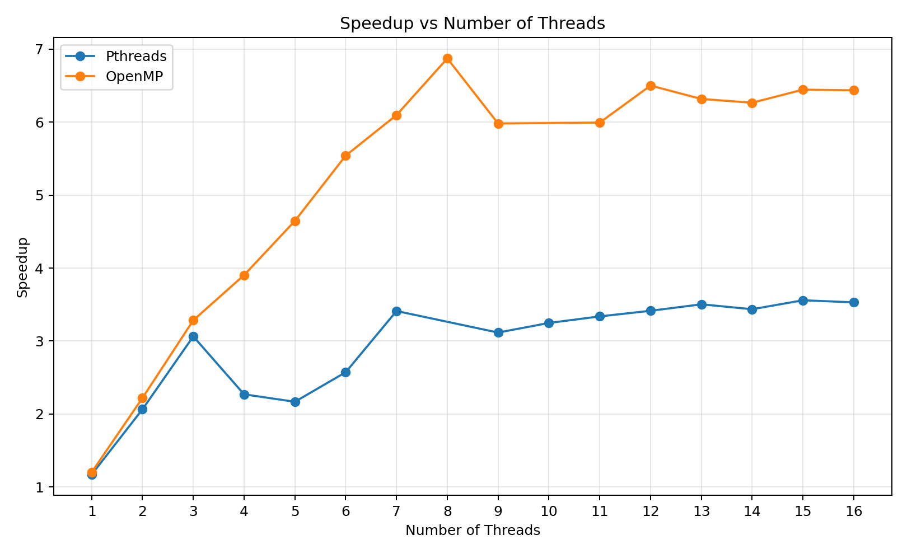
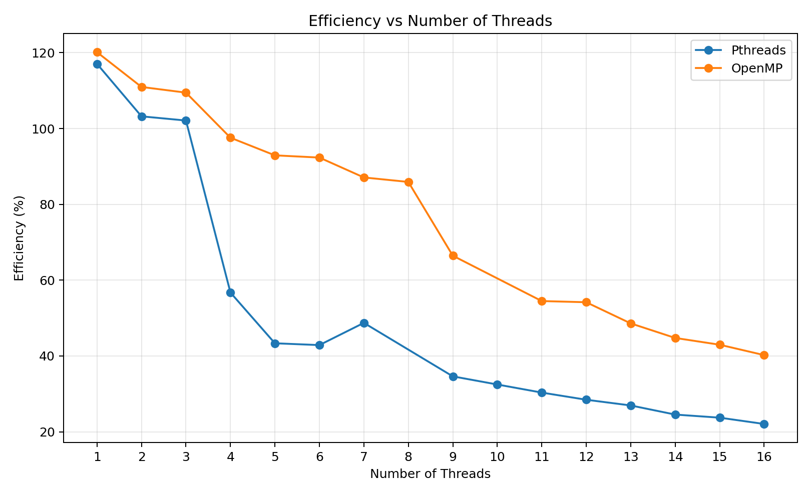

# THREE PERFORMANCE GRAPHS

This folder contains the three required graphs generated **only from the execution-time results visible in the supplied screenshots**.

## Graph 1 — Execution Time

- X-axis: Number of Threads
- Y-axis: Execution Time (seconds)
- Series: Pthreads and OpenMP

## Graph 2 — Speedup

- X-axis: Number of Threads
- Y-axis: Speedup
- Series: Pthreads Speedup and OpenMP Speedup

## Graph 3 — Efficiency

- X-axis: Number of Threads
- Y-axis: Efficiency (%)
- Series: Pthreads and OpenMP

## Important data note

The screenshots do not contain a Pthreads result for 8 threads and do not contain an OpenMP result for 10 threads. Those points are therefore left absent from the graphs rather than being invented or taken from the manual.

The manual's example values are not substituted for the user's measurements.
